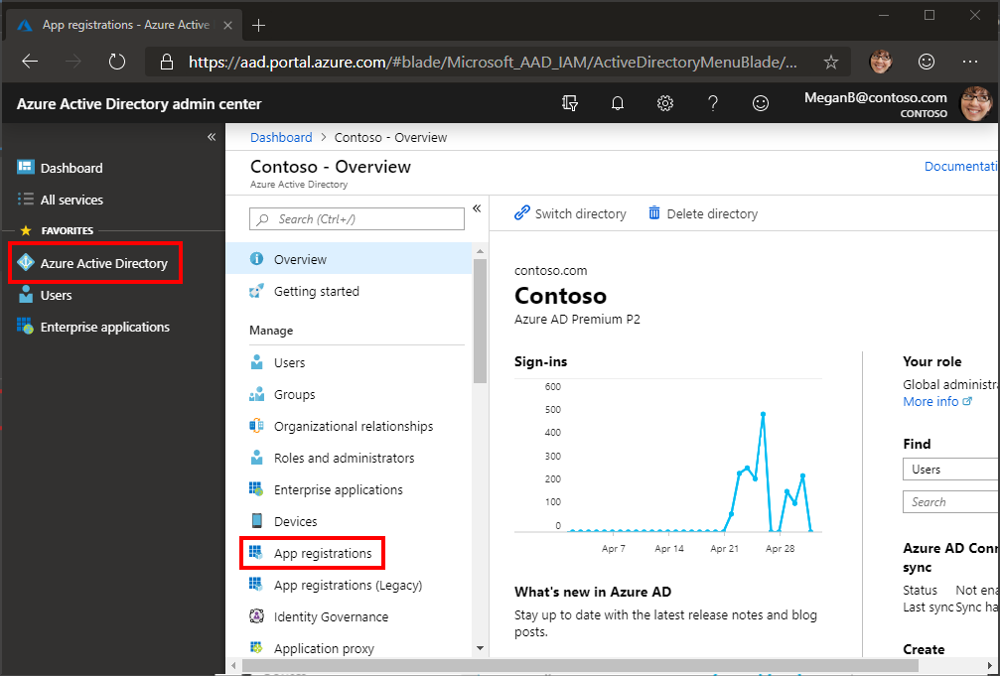

<!-- markdownlint-disable MD002 MD041 -->

In dieser Übung erstellen Sie mithilfe des Azure Active Directory Admin Center eine neue Azure AD systemeigene Anwendung.In this exercise you will create a new Azure AD native application using the Azure Active Directory admin center.

1. Öffnen Sie einen Browser, und navigieren Sie zum [Azure Active Directory Admin Center](https://aad.portal.azure.com). Melden Sie sich mit einem **persönlichen Konto** (auch: Microsoft-Konto) oder einem **Geschäfts- oder Schulkonto** an.Open a browser and navigate to the [Azure Active Directory admin center](https://aad.portal.azure.com) and login using a **personal account** (aka: Microsoft Account) or **Work or School Account**.

1. Wählen Sie in der linken Navigationsleiste **Azure Active Directory** aus, und wählen Sie dann **App-Registrierungen** unter **Manage**aus.Select **Azure Active Directory** in the left-hand navigation, then select **App registrations** under **Manage**.

    

1. Wählen Sie **Neue Registrierung** aus.Select **New registration**. Legen Sie auf der Seite **Anwendung registrieren** die Werte wie folgt fest.On the **Register an application** page, set the values as follows.

    - Legen Sie **Name** auf `React Native Graph Tutorial` fest.Set **Name** to `React Native Graph Tutorial`.
    - Legen Sie **Unterstützte Kontotypen** auf **Konten in allen Organisationsverzeichnissen und persönliche Microsoft-Konten** fest.Set **Supported account types** to **Accounts in any organizational directory and personal Microsoft accounts**.
    - Ändern Sie unter **Umleitungs-URI**das Dropdown-Menü auf **Public Client (Mobile #a0 Desktop)**, `graph-tutorial://react-native-auth`und legen Sie den Wert auf fest.Under **Redirect URI**, change the dropdown to **Public client (mobile & desktop)**, and set the value to `graph-tutorial://react-native-auth`.

    

1. Wählen Sie **registrieren**aus.Select **Register**. Kopieren Sie auf der Seite **systemeigene Graph-Lernprogramm reagieren** den Wert der **Anwendungs-ID (Client)** , und speichern Sie Sie, um Sie im nächsten Schritt zu benötigen.On the **React Native Graph Tutorial** page, copy the value of the **Application (client) ID** and save it, you will need it in the next step.

    

1. Wählen Sie unter **Verwalten**die Option **Authentifizierung**aus.Under **Manage**, select **Authentication**. Fügen Sie auf der Seite " **Umleitungs-URIs** " einen weiteren Umleitungs-URI vom Typ " **Public Client" (Mobile #a0 Desktop)** mit dem URI `urn:ietf:wg:oauth:2.0:oob`hinzu.On the **Redirect URIs** page, add another redirect URI of type **Public client (mobile & desktop)**, with the URI `urn:ietf:wg:oauth:2.0:oob`. Klicken Sie auf **Speichern**.Select **Save**.

    
