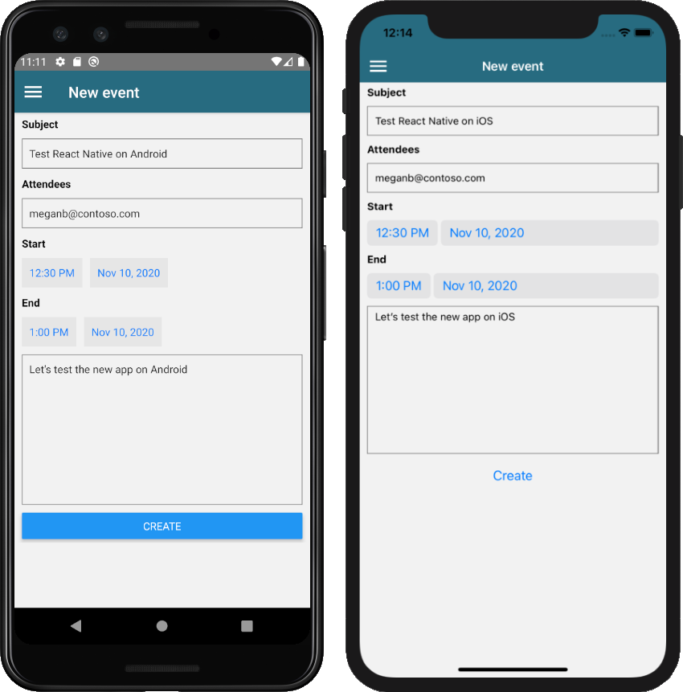

<!-- markdownlint-disable MD002 MD041 -->

In diesem Abschnitt können Sie die Möglichkeit zum Erstellen von Ereignissen im Kalender des Benutzers hinzufügen.

## <a name="create-the-new-event-screen"></a>Erstellen des neuen Ereignis Bildschirms

1. Öffnen Sie **/Graph/GraphManager.TS** , und fügen Sie der-Klasse die folgende Funktion hinzu `GraphManager` .

    :::code language="typescript" source="../demo/GraphTutorial/graph/GraphManager.ts" id="CreateEventSnippet":::

    Diese Funktion verwendet das Graph-SDK, um ein neues Ereignis zu erstellen.

1. Erstellen Sie eine neue Datei im **./Screens** mit dem Namen **NewEventScreen. TSX** , und fügen Sie den folgenden Code hinzu.

    :::code language="typescript" source="../demo/GraphTutorial/screens/NewEventScreen.tsx" id="NewEventScreenSnippet":::

    Überprüfen Sie die Funktionsweise der `createEvent` Funktion. Es wird ein `MicrosoftGraph.Event` Objekt mithilfe der Werte aus dem Formular erstellt und übergibt dann dieses Objekt an die `GraphManager.createEvent` Funktion.

1. Öffnen Sie **/Menus/DrawerMenu.TSX** , und fügen Sie die folgende `import` Anweisung am Anfang der Datei hinzu.

    ```typescript
    import NewEventScreen from '../screens/NewEventScreen';
    ```

1. Fügen Sie den folgenden Code innerhalb des `<Drawer.Navigator>` -Elements direkt oberhalb der `</Drawer.Navigator>` Linie hinzu.

    ```typescript
    { userLoaded &&
      <Drawer.Screen name='NewEvent'
        component={NewEventScreen}
        options={{drawerLabel: 'New event'}} />
    }
    ```

1. Speichern Sie Ihre Änderungen, und starten oder aktualisieren Sie die APP neu. Wählen Sie die Option **Neues Ereignis** im Menü aus, um zum neuen Ereignis Formular zu gelangen.

1. Füllen Sie das Formular aus, und wählen Sie **Erstellen** aus.

    
